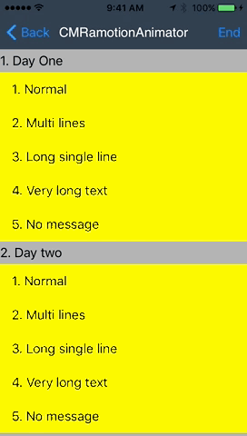

<p align="left" >
  
</p>

[](https://raw.githubusercontent.com/chucklab/CMRefresh/master/LICENSE)
[](https://github.com/Carthage/Carthage)
[](https://cocoapods.org/pods/CMRefresh)

[](https://www.apple.com/nl/ios/)


Some util refresh categories for UIScrollView and it's subclasses, which write in Objective-C, wish you love it, enjoy the code:D



## Installation
### Cocoapods:

1. Add `pod 'CMRefresh', '~> 0.1.1'` to your Podfile.
2. Run `pod install` or `pod update`.
3. Import \<CMRefresh.h\>.

### Carthage:

1. Add `github "chucklab/CMRefresh"` to your Cartfile.
2. Run `carthage update --platform ios` and add the framework to your project.
3. Import \<CMRefresh/CMRefresh.h\>.

## Usage

Header

```objc
__weak typeof(self) weakSelf = self;
[tableView.cm addHeadRefreshWithAnimator: nil handler: ^{

    // Refresh Handler ...

    dispatch_after(dispatch_time(DISPATCH_TIME_NOW, (int64_t)(3 * NSEC_PER_SEC)), dispatch_get_main_queue(), ^{
        [weakSelf.tableView.cm endHeaderRefresh];
        [weakSelf.tableView.cm resetNoMore];
    });
}];
```

Footer

```objc
[tableView.cm addFootRefreshWithAnimator: nil handler: ^{
    
    // Footer Handler ...
    
    dispatch_after(dispatch_time(DISPATCH_TIME_NOW, (int64_t)(3 * NSEC_PER_SEC)), dispatch_get_main_queue(), ^{
        if (newData) {
            
            // Load new data ...
            
            [weakSelf.tableView.cm endLoadingMore];
            
        } else {
            [weakSelf.tableView.cm noticeNoMoreData];
        }
    });
}];
```

## Requirements
This library requires a deployment target of iOS 8.0 or greater.

## License
CMRefresh is provided under the MIT license. See LICENSE file for details.

